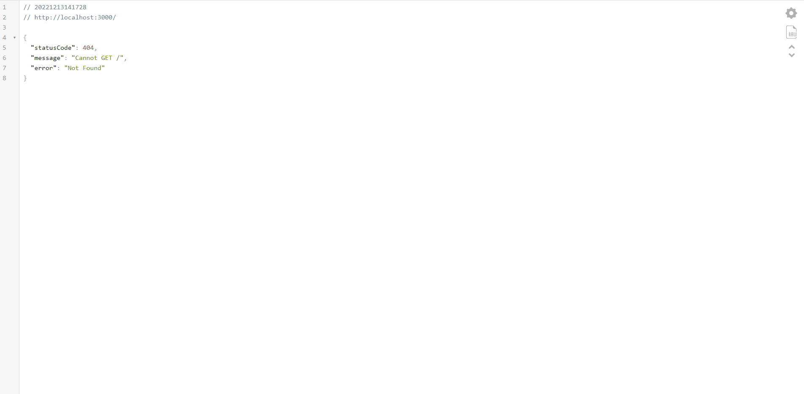

<h1 align="center">
  <span>Ignite LAB - NodeJs</span>
</h1>

<p align="center">
  <a href="#-projeto">Projeto</a>&nbsp;&nbsp;&nbsp;|&nbsp;&nbsp;&nbsp;
  <a href="#-tecnologias">Tecnologias</a>&nbsp;&nbsp;&nbsp;|&nbsp;&nbsp;&nbsp;
  <a href="#-instalação">Instalação</a>&nbsp;&nbsp;&nbsp;|&nbsp;&nbsp;&nbsp;
  <a href="#memo-licença">Licença</a>
</p>

<br>

<p align="center">
  
</p>

<br>

## 💻 Projeto

Aplicação desenvolvida durante o Ignite Lab promovido pela Rocketseat. Objetivo da aplicação é enviar notificações para os serviços que se conectarem a ela, utilizando o conceito de microserviços.


## 🚀 Tecnologias

Esse projeto foi desenvolvido com as seguintes tecnologias:

- NodeJs
- Prisma
- Nest

## 📥 Instalação

Faça um clone desse repositório e rode:
```bash
npm i
npm run start:dev
```


## :memo: Licença

Esse projeto está sob a licença MIT. Veja o arquivo [LICENSE](LICENSE.md) para mais detalhes.

---
**Desenvolvido por [Bruno César](https://github.com/brunocs90).**
